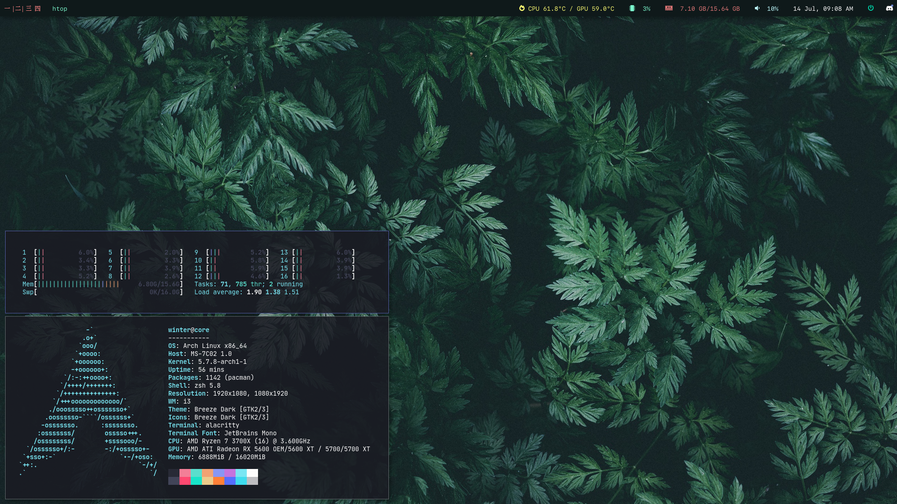

# My Arch Linux Dotfiles (Matebook 14)

### This repository is mainly used as a backup.

<!--- ### The current theme was inspired by this https://github.com/ngynLk/polybar-themes#blocks -->

| Type | Package |
|---|---|
| Window Manager | i3-gaps |
| Compositor | picom |
| Terminal | alacritty |
| Notificaiton Server | dunst |
| Status bar | polybar |
| Application Launcher | rofi |
| Shell | ohmyzsh & pure |
| Editor | neovim |
| Sound Server | pulseaudio |
| Music Player | mpd |
| Browser | chrome |
| Clipboard | clipster & roficlip |

