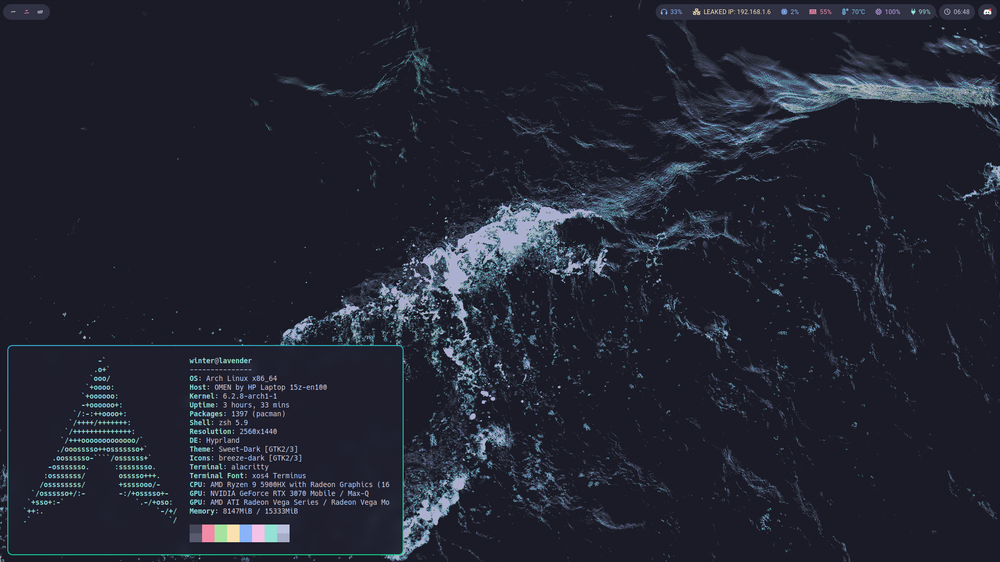

# My Arch Linux Dotfiles (HP Omen 15 2021)

### This repository is mainly used as a backup.

<!--- ### The current theme was inspired by this https://github.com/ngynLk/polybar-themes#blocks -->

| Type                 | Package                                                                     |
|----------------------|-----------------------------------------------------------------------------|
| Window Manager       | [i3](https://wiki.archlinux.org/title/i3)                                   |
| Compositor           | [Picom](https://wiki.archlinux.org/title/Picom)                             |
| Terminal             | [Alacritty](https://wiki.archlinux.org/title/Alacritty)                     |
| Notificaiton Server  | [Dunst](https://wiki.archlinux.org/title/Dunst)                             |
| Status bar           | [Polybar](https://wiki.archlinux.org/title/Polybar)                         |
| Application Launcher | [Rofi](https://wiki.archlinux.org/title/Rofi)                               |
| Shell                | [OhMyZsh](https://ohmyz.sh/) & [Pure](https://github.com/sindresorhus/pure) |
| Editor               | [Neovim](https://neovim.io/)                                                |
| Sound Server         | [PulseAudio](https://wiki.archlinux.org/title/PulseAudio)                   |
| Music Player         | [mpd](https://wiki.archlinux.org/title/Music_Player_Daemon)                 |
| Browser              | Chrome (firefox is so buggy)                                                |
| Theme                | [Sweet Dark](https://www.gnome-look.org/p/1253385)                          |

### External monitors setup

Making the external monitors work with the Nvidia GPU was a pain.
I ended up using [Optimus Manager](https://github.com/Askannz/optimus-manager) in Hybrid mode to be able to use the DPI & HDMI ports including the port provided by the USB-C port (which is connected to the integrated AMD GPU).
